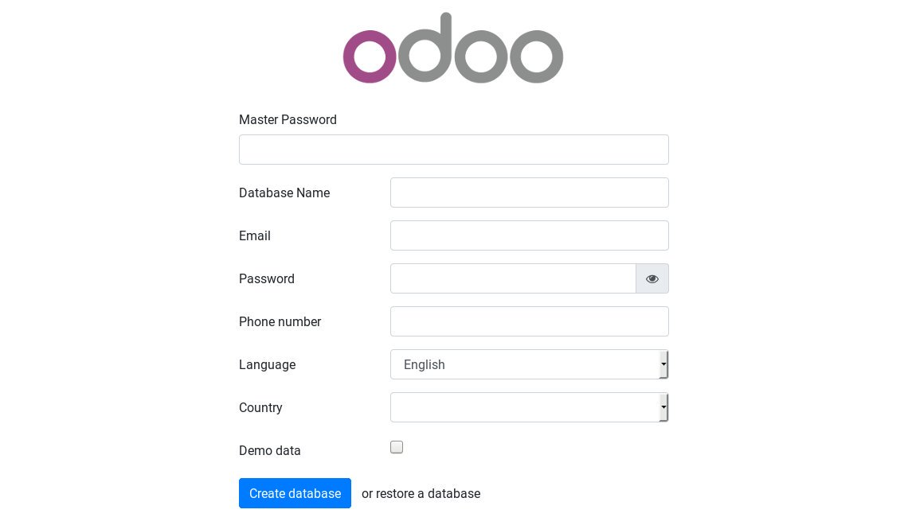

This article is created based on [linuxize.com](https://linuxize.com/post/how-to-deploy-odoo-12-on-ubuntu-18-04/)

# How to deploy Odoo 12 on Ubuntu 18.04

## Before you begin
Login to you ubuntu machine as a **sudo user** and update the system to the latest packages:
```
$ sudo apt update && sudo apt upgrade
```
Install **Git, Pip, Nodejs** and the tools required to build Odoo dependencies:
```
$ sudo apt install git python3-pip build-essential wget python3-dev python3-venv python3-wheel libxslt-dev libzip-dev libldap2-dev libsasl2-dev python3-setuptools node-less
```

## Create Odoo user
Create a new system user for Odoo named odoo12 with home directory `/opt/odoo12` using the following command:
```
$ sudo useradd -m -d /opt/odoo12 -U -r -s /bin/bash odoo12
```
>You can use any name for your Odoo user as long you create a PostgresSQL user with the same name.

## Install and Configure PostgreSQL
Install the **PostgreSQL** package from the Ubuntu's default repositories:
```
$ sudo apt install postgres
```
Start PostgreSQL
```
$ sudo service postgresql start
```
Create a PostgreSQL user with the same name as the previously created system userm, in our case that is odoo12:
```
$ sudo su - postgres -c "createuser -s odoo12"
```

## Install Wkhtmltopdf
The `wkhtmltopdf` packages provides a set of open-source command line tools which can render HTML into PDF and various image formats.
Download the package using the following **wget** command:
```
$ wget https://builds.wkhtmltopdf.org/0.12.1.3/wkhtmltox_0.12.1.3-1~bionic_amd64.deb
```
Once the download is completed install the package by typing and this is saved in the current directory that you input command.
```
$ sudo apt install ./wkhtmltox_0.12.1.3-1~bionic_amd64.deb
```
And I usually delete package file that everything happy.
```
$ sudo rm ./wkhtmltox_0.12.1.3-1~bionic_amd64.deb
```

## Install and Configure Odoo
We will install Odoo from Github repository inside an isolated [Python virtual environment](https://linuxize.com/post/how-to-create-python-virtual-environments-on-ubuntu-18-04/)
Before starting with the installation process, **change to user** "odoo12":
```
$ sudo su - odoo12
```
Starting by cloning the Odoo12 source code from the Odoo Github repository:
```
$ git clone https://www.github.com/odoo/odoo --depth 1 --branch 12.0 /opt/odoo12/odoo
```
Once the source code is downloaded, create a new PYthon virtual environment for the Odoo 12 installation:
```
$ cd /opt/odoo12
$ python3 -m venv odoo-env
```
Next, activate the environment with the following command:
```
$ source odoo-venv/bin/activate
```
Install all required Python modules with pip3:
```
(venv) $ pip3 install wheel
(venv) $ pip3 install -r odoo/requirements.txt
```
Deactivate the environment using the following command:
```
(venv) $ deactivate
```
Create a new directory for the custom addons:
```
$ mkdir /opt/odoo12/odoo-custom-addons
```
Switch back to your sudo user with `exit`
```
$ exit
```
Next, edit configuration file:
```
$ sudo nano /opt/odoo12/odoo/debian/odoo.conf
```
```
[options]
; This is the password that allows database operations:
; admin_passwd = admin
db_host = False
db_port = False
db_user = Odoo12
db_password = False
addons_path = /opt/odoo12/odoo/addons,/opt/odoo12/odoo-custom-addons
```
> If you run config admin_passwd, Do not forget to change `admin` to something more secure.

## Test the Installation
```
$ su - odoo12
$ odoo/odoo-bin
```
